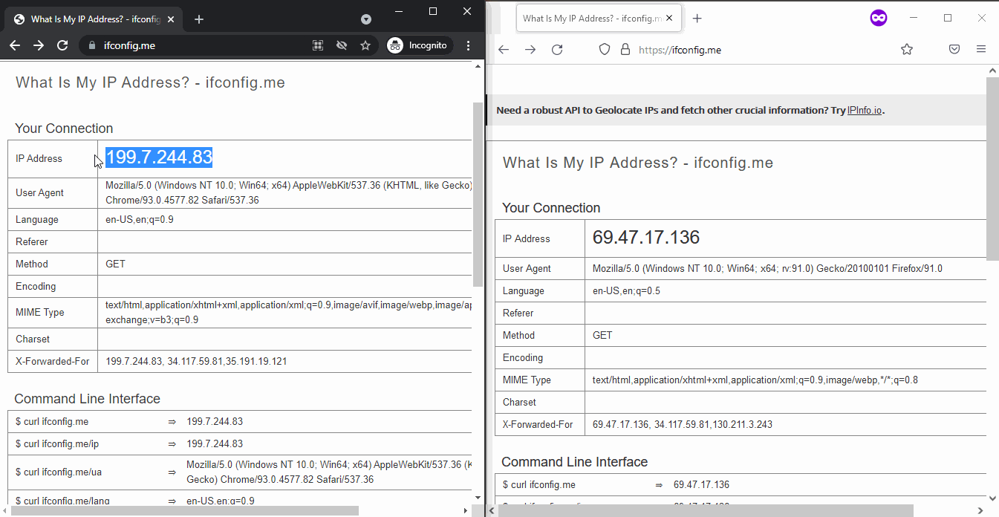

# Introduction
Share files and clipboard content real-time, securely and privately using your own AWS account. This repository includes everything to create an AWS "serverless" environment using Terraform's infrastructure as code (IaC) tool.
### Benefits & Features
- The entire AWS environment can be created, and if needed destroyed, with the provided Terraform code in a matter of minutes.
- The website, directly hosted on an S3 Bucket, and the API Gateway are on Amazon domains, so they are unlikely to be blocked.
- Authentication is secured by dynamically created Cognito user pools with "throwaway" credentials in order to provide easy access.
- Shared files are securely stored in a private AWS S3 bucket's folder with a 1 day expiration policy to ensure that files are only retained for a short period of time.
- The website can generate a pre-signed URL for any uploaded file with a 1 hour expiration for sharing files quickly.
- Content of the "clipboard" is securely proxied by an AWS API Gateway real-time between logged in web browsers using WebSockets without storing it in the cloud.

### Demo

# Getting started
1. As a prerequisite, make sure [Terraform](https://learn.hashicorp.com/tutorials/terraform/install-cli) and [Git](https://git-scm.com/book/en/v2/Getting-Started-Installing-Git) are installed on your computer.
2. Clone this git repo and change into the terraform directory
```
git clone <GIT_URL>
cd terraform
```
3. Change the the variable in the variables.tf file. Please note, that if you do not pick an unused AWS S3 bucket name the run will fail!
- name: (Mandatory) Unique AWS S3 bucket name that is also used as a prefix for ALL resource names created by Terraform.
- password: (Optional) The password used for the defualt admin user (Default: Admin123#).
- region: (Optional) The AWS region where the resources will be created (Default: us-east-1).

4. Use the terraform command to initialize, plan and apply changes to your environment. You have to be in the terraform subdirectory to do this.
```
terraform init
terraform plan
terraform apply
```
5. Copy the terraform output URL shown in the command line and open it in a browser. Login with the admin account.
```
https://s3.[REGION].amazonaws.com/[NAME]/index.html"
```
6. Upload/Download files and inspect the corresponding AWS environment (S3, Cognito, API Gateway, Lambda, Cloudwatch). Use the clipboard to transfer text real-time between browsers.
7. When you are ready, destroy the entire AWS environment. All newly created AWS resources should be deleted.
```
- terraform destroy
```
# Password Change
Currently only the admin user is supported with an initial password provided at setup time. The admin password can be changed using AWS CLI. Example:
```
# aws cognito-idp admin-set-user-password --user-pool-id "<USER-POOL-ID>"  --username "admin" --password "<NEW-COMPLEX-PASSWORD>" --permanent
aws cognito-idp admin-set-user-password --user-pool-id "us-east-1_7GZQCV8KY"  --username "admin" --password "MyP@ssword1shere!" --permanent
```

# Directory Layout
```text
.
├── terraform           -> Terraform folder
│   ├── main.tf         -> Terraform AWS provider and data definitions
│   ├── variables.tf    -> Terraform Input variables
│   ├── output.tf       -> Terraform Output variables for Website and WebSocket URLs
│   ├── api_gateway.tf  -> Terraform API Gateway resources
│   ├── cloudwatch.tf   -> Terraform CloudWatch resources
│   ├── cognito.tf      -> Terraform Cognito resources
│   ├── dynamodb.tf     -> Terraform Dynamo DB resources
│   ├── iam.tf          -> Terraform IAM resources (roles & policies)
│   ├── lambda.tf       -> Terraform Lambda resources (roles & policies)
│   ├── s3.tf           -> Terraform S3 resources for the web front-end
│   └── lambda_clipboard_connect        
│       └── index.js                    -> Node.js back-end code handling WebSocket connect
│   └── lambda_clipboard_disconnect     
│       └── index.js                    -> Node.js back-end code handling WebSocket disconnect
│   └── lambda_clipboard_sendmessage    
│       └── index.js                    -> Node.js back-end code replicating clipboard realtime changes to all connected clients
│   └── lambda_create_cognito_user      
│       └── index.py                    -> Python back-end code that creates the admin user and resets the password
│   └── template                        
│       └── awsconfig.json              -> Terraform JSON template to provide AWS resource IDs for the web front-end
│
├── dist                -> Production front-end to S3 bucket (by 'npm build')
├── public              -> Static files for the web front-end
├── src                 -> Vue.js folder
│   ├── main.js         -> Starting point
│   ├── App.js          -> Vue root
│   ├── store.js        -> Vuex store
│   └── components      -> Vue.js components
│       ├── helpers.js      -> JavaScript helper functions
│       ├── Header.js       -> Header for login and status
│       ├── S3Files.js      -> Main Body for sub-components
│       ├── Navbar.js       -> Navigation bar sub-components
│       ├── Download.js     -> Download sub-components
│       ├── Upload.js       -> Upload sub-components
│       ├── Clipboard.js    -> Clipboard sub-components
│       ├── InpoutForm.js   -> Reusable components for inputs
│       ├── ModalMessage.js -> Reusable components for Modal Messages
│       └── ToastMessage.js -> Reusable components for Toast Messages
│
└── README.md           -> This readme file
